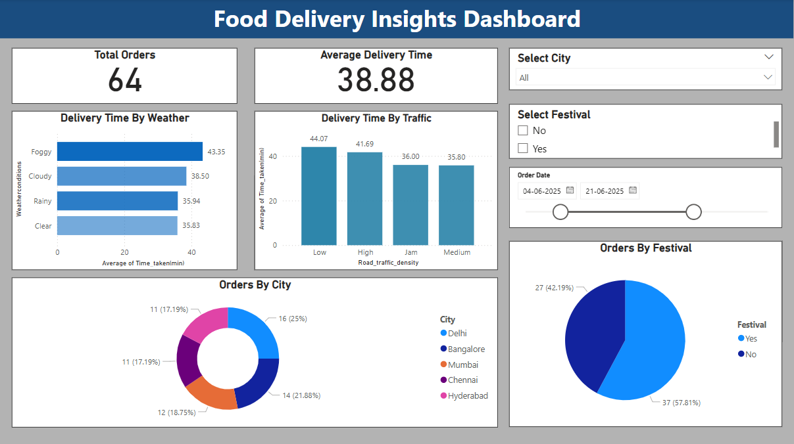

# 🍽️ Food Delivery Insights Dashboard

This is an interactive data visualization project built using **Power BI**, based on CSV data from a food delivery service.

---

## 📌 Project Overview

The dashboard helps understand key delivery metrics like:
- How weather and traffic affect delivery times
- Order distribution by city
- Impact of festivals on order volume

---

## 📁 Files Included

 `FoodDeliveryDashboard.pbix` → Power BI file                     
 `food_data.csv`              → Raw data file used in dashboard      
 `dashboard_food.png`         → Dashboard preview screenshot         
 `README.md`                  → Project documentation                

---

## 📊 Dashboard Features

- 🚚 Total Orders and Average Delivery Time cards
- 🌦️ Delivery Time by Weather Conditions (Bar Chart)
- 🚦 Delivery Time by Traffic Density
- 🏙️ Orders by City (Donut Chart)
- 🎉 Orders by Festival (Pie Chart)
- 📅 Date Range slicer
- 📍 City and Festival filters

---

## 🛠 Tools Used

- 📌 Power BI Desktop
- 📂 CSV File for data source
- 🎯 Visuals: Cards, Pie Chart, Bar Graph, Slicers

---

## 🚀 How to Use

1. Clone/download the repository
2. Open `FoodDeliveryDashboard.pbix` in Power BI Desktop
3. Make sure `food_data.csv` is in the same folder (or update path)
4. Refresh data and explore visuals

